<div align="center">

# Sleep Token KB

**A custom iOS system keyboard that puts the ritual alphabet on your keys — and a composer that writes real vertical runes.**

[](https://developer.apple.com/ios/)
[](https://swift.org)
[](https://developer.apple.com/xcode/swiftui/)
[](#testing)
[](LICENSE)

[](#project-structure)
[](#the-ritual-alphabet)
[](#two-themes)
[](#the-keyboard)
[](#rune-pad)
[](#privacy--full-access)
[](#getting-started)
[](#legal)

<br>

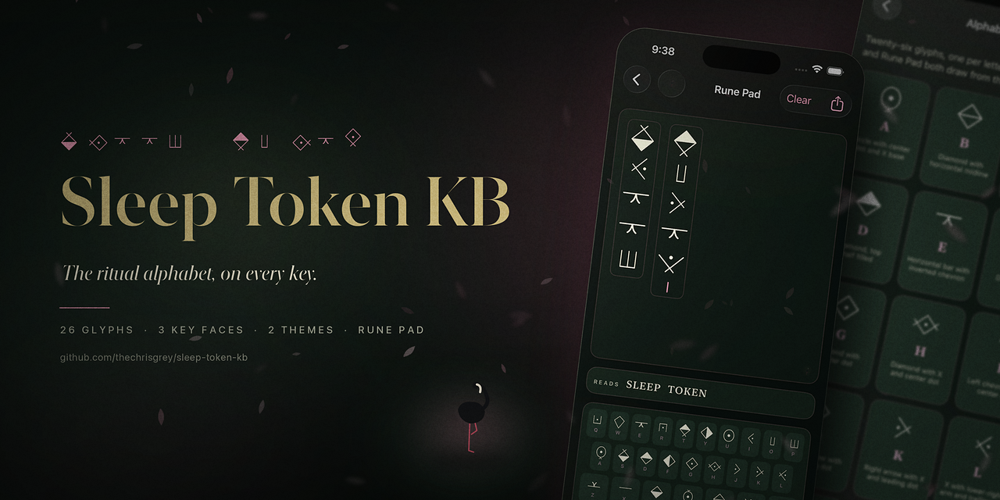

</div>

---

## Contents

- [What this is](#what-this-is)
- [Features](#features)
- [The keyboard](#the-keyboard)
- [Rune Pad](#rune-pad)
- [The ritual alphabet](#the-ritual-alphabet)
- [Two themes](#two-themes)
- [Jerry](#jerry)
- [Architecture](#architecture)
- [How state flows](#how-state-flows)
- [Getting started](#getting-started)
- [Testing](#testing)
- [Project structure](#project-structure)
- [Accessibility](#accessibility)
- [Privacy & Full Access](#privacy--full-access)
- [Regenerating the glyph assets](#regenerating-the-glyph-assets)
- [Social preview](#social-preview)
- [Legal](#legal)

---

## What this is

Two things that work together, wrapped in one app:

| | |
|---|---|
| **A system keyboard** | Ritual glyphs on the keycaps, but every keystroke inserts ordinary English. It works in Messages, Notes, Safari, anywhere — because the text you send is plain `a`–`z`. The runes are the *interface*, not the payload. |
| **Rune Pad** | When you want the runes themselves, compose them here: vertical columns of real glyphs, read back in Latin as you type, exported as transparent PNGs, a plaque image, or plain text. |

The split exists because iOS keyboards can only insert text, and rune text would arrive as tofu in every app that lacks the font. So the keyboard stays honest and universal, and Rune Pad carries the runes out as pictures.

---

## Features

| Feature | Notes |
|---------|-------|
| **QWERTY layout** | Muscle-memory typing with glyph keycaps |
| **A–Z grid layout** | The learning layout; every letter in alphabetical order |
| **Three key faces** | One key cycles `Rune` → `Rune·A` → `Aa`: pure glyphs, glyphs with a Latin hint beneath, or plain letters |
| **Always-English insert** | Tapping any key inserts `a`–`z` / `A`–`Z`; the key face is cosmetic |
| **Shift & caps lock** | Tap for one letter, tap again for sticky caps lock, third tap releases |
| **123 page** | Digits and punctuation with its own backspace |
| **Rune Pad** | Vertical composition, live Latin read-back, spell check, five export formats |
| **Two themes** | Ritual (obsidian and gold) or Even in Arcadia (pink on black stone) |
| **Haptics** | Per-keystroke feedback, toggleable |
| **Jerry** | He is in the app. Ten times. [Find him](#jerry) |
| **Full Access** | **Not required.** `RequestsOpenAccess = false` |

---

## The keyboard

<div align="center">
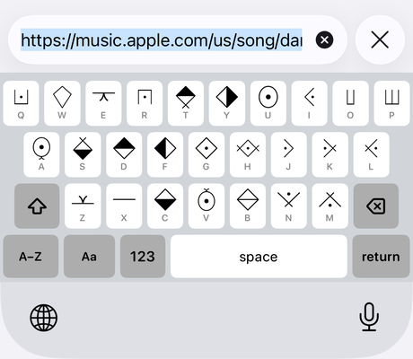
<br>
<sub><i>Running inside Safari, in the Rune·A face — glyph above, Latin letter below</i></sub>
</div>

<br>

The bottom bar carries five controls: the globe (next keyboard, shown only when the system asks for it), the layout toggle, the key-face cycle, the `123`/`ABC` page key, space, and return. Every switch key names its **destination**, never its current state, so no two adjacent keys can ever show the same label.

### The key face cycle

One key, three faces. The label always shows where the next tap takes you.

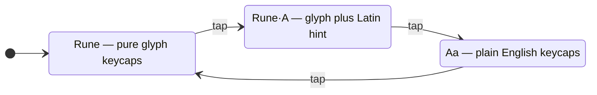

The hinted face uses taller keys (44pt vs 40pt), so the container reserves the **tallest** face for the current page — cycling mid-session can never clip a visible row.

### Shift

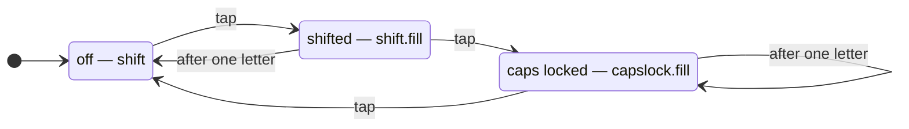

Each state has its own SF Symbol and its own VoiceOver value, so caps lock is never mistaken for a one-shot shift.

---

## Rune Pad

<div align="center">
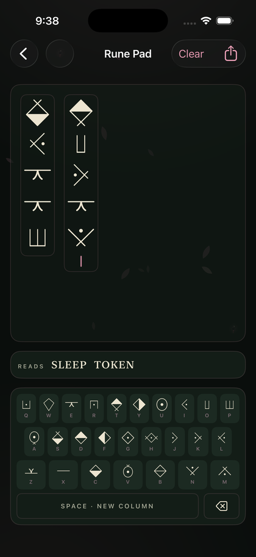
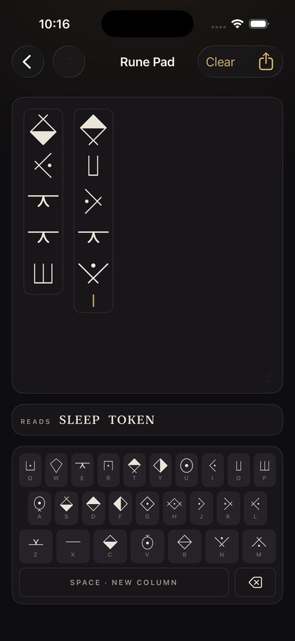
<br>
<sub><i>The same composition in both themes — Even in Arcadia (left) and Ritual (right)</i></sub>
</div>

<br>

Each space starts a new **column**; runes stack top to bottom. The canvas binary-searches the largest glyph size that still fits, so long messages shrink instead of overflowing. The letter pad is anchored to the bottom like a real keyboard, and the canvas takes every remaining point of height.

### Live Latin read-back

A `READS` strip translates the composed runes back to Latin on every keystroke and spell-checks each finished word with `UITextChecker`. Words outside the dictionary are underlined in amber.

Two deliberate details:

- **Proper nouns pass.** A word is accepted if either its lowercase *or* capitalized form is known — so `EUCLID` and `ARCADIA` are not flagged as mistakes.
- **The word you're still typing is left alone.** Only completed columns are judged, so nothing flickers amber mid-word.

### Export

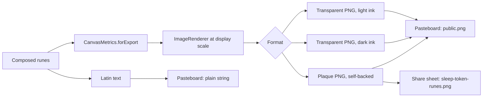

| Format | Use it for |
|--------|-----------|
| **Copy image · for dark backgrounds** | Transparent PNG, light ink — Messages dark mode, dark Stories |
| **Copy image · for light backgrounds** | Transparent PNG, dark ink — Notes, light chats, documents |
| **Copy image · on plaque** | Obsidian card that brings its own background; legible anywhere |
| **Share as image** | System share sheet — AirDrop, Photos, Save to Files |
| **Copy as Latin text** | The plain-English reading, for search or spell check elsewhere |

Copies write an explicit `public.png` pasteboard item so alpha survives into apps that would otherwise flatten it to JPEG.

---

## The ritual alphabet

Twenty-six glyphs, one per letter, mapped into the Unicode **Private Use Area** at `U+E900`–`U+E919`. The keyboard draws them from vector assets; Rune Pad can also render them from the bundled `SleepTokenRunes.ttf`.

<div align="center">
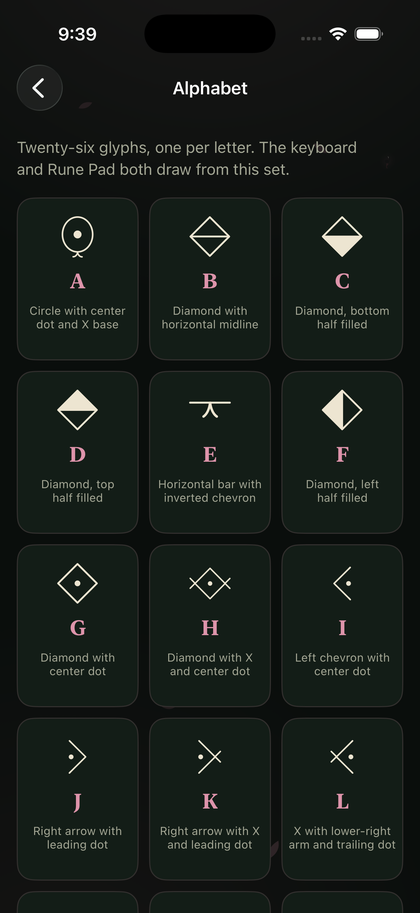
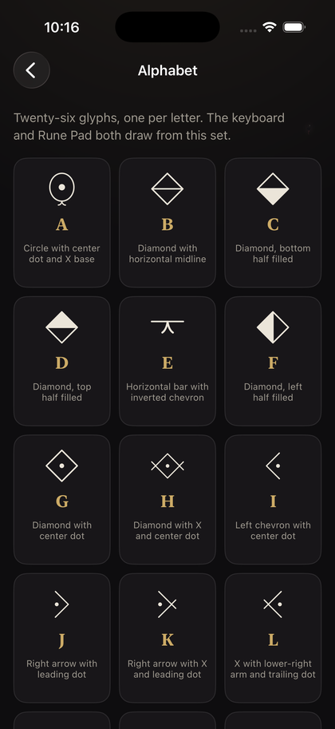
</div>

| Letter | Codepoint | Glyph construction | | Letter | Codepoint | Glyph construction |
|:---:|:---:|---|---|:---:|:---:|---|
| **A** | `U+E900` | Circle with center dot and X base | | **N** | `U+E90D` | V with X and apex dot |
| **B** | `U+E901` | Diamond with horizontal midline | | **O** | `U+E90E` | Double vertical arches |
| **C** | `U+E902` | Diamond, bottom half filled | | **P** | `U+E90F` | Triple vertical arches |
| **D** | `U+E903` | Diamond, top half filled | | **Q** | `U+E910` | Open square with center dot |
| **E** | `U+E904` | Horizontal bar with inverted chevron | | **R** | `U+E911` | Closed square with center dot |
| **F** | `U+E905` | Diamond, left half filled | | **S** | `U+E912` | Diamond, bottom filled, X on top |
| **G** | `U+E906` | Diamond with center dot | | **T** | `U+E913` | Diamond, top filled, X below |
| **H** | `U+E907` | Diamond with X and center dot | | **U** | `U+E914` | Concentric circles with center |
| **I** | `U+E908` | Left chevron with center dot | | **V** | `U+E915` | Circle with center and X above |
| **J** | `U+E909` | Right arrow with leading dot | | **W** | `U+E916` | Open diamond |
| **K** | `U+E90A` | Right arrow with X and leading dot | | **X** | `U+E917` | Horizontal bar |
| **L** | `U+E90B` | X with lower-right arm and trailing dot | | **Y** | `U+E918` | Diamond, right half filled |
| **M** | `U+E90C` | Peak with X and base center dot | | **Z** | `U+E919` | Horizontal bar with Y below |

Every glyph has a hand-coded geometric fallback drawn with `Canvas`, so a missing asset degrades to a readable key instead of a blank one.

---

## Two themes

The host app wears one of two aesthetics. Switching is purely cosmetic — no screen, control, or behaviour changes. The keyboard extension is deliberately excluded: it lives inside other apps and mirrors the system keyboard in both light and dark.

<div align="center">

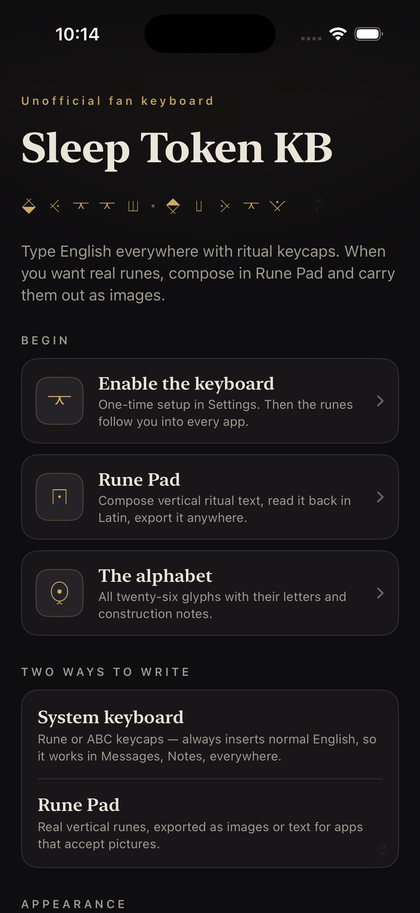
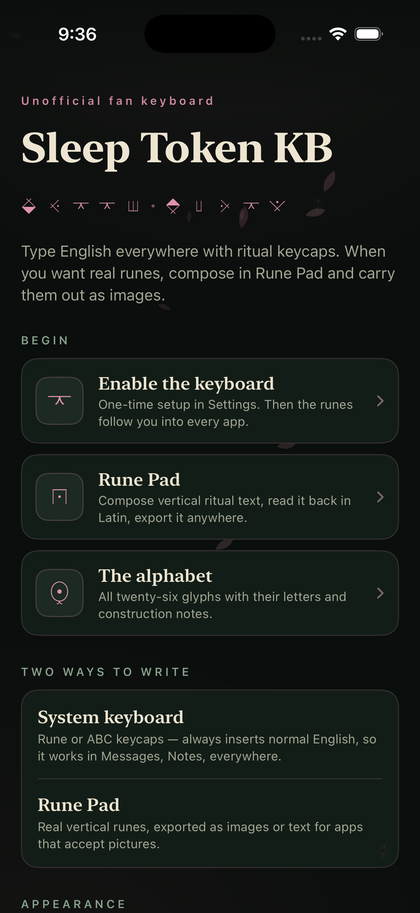

<sub><i>Ritual (left) and Even in Arcadia (right)</i></sub>

</div>

| | **Ritual** | **Even in Arcadia** |
|---|---|---|
| Field | Obsidian, near-black | Black stone with a breath of green |
| Cards | Neutral raised surface | Deep arcadian green — the flag |
| Accent | Antique gold | Dusty rose |
| Ink | Bone | Champagne |
| Ornament | The word `worship` in runes | Jerry, the black flamingo |
| Atmosphere | A single candlelit bloom | Two blooms and drifting pink petals |

Choosing **Even in Arcadia** plays a one-time ceremony: a black curtain rises, petals begin to fall, the `SLEEP TOKEN` wordmark breathes in from the dark in champagne serif — letterspacing settling, blur burning off — then dissolves into the re-themed app. The theme flip happens *behind* the opaque curtain, so the recolour is never seen raw. Reduce Motion gets a clean crossfade instead.

---

## Jerry

> [!NOTE]
> Spoilers below. If you'd rather find him yourself, skip this section.

<details>
<summary><b>What is the Jerry hunt?</b></summary>

<br>

Jerry — black body, white beak, pink legs — is hidden **ten times** across the host app at about 13% opacity. He is drawn entirely in code; no album artwork ships in this repository.

Each find pops a rose `N of 10` counter, permanently brightens that Jerry so you can track progress, persists across relaunch, and announces itself to VoiceOver.

Find all ten and the app plays a ceremony — petal storm, Jerry at full height, `DAMOCLES` in champagne serif — then opens the song on Apple Music.

**The song is linked, never bundled.** The audio is not ours to ship.

</details>

<details>
<summary><b>Where are they?</b> (full spoilers)</summary>

<br>

| # | Screen | Where |
|---|--------|-------|
| 1 | Home | Perched at the end of the `SLEEP TOKEN` rune wordmark |
| 2 | Home | Corner of the "Two ways to write" card |
| 3 | Home | Corner of the Appearance card |
| 4 | Home | Beside the footer |
| 5 | Enable keyboard | Corner of the Setup card |
| 6 | Enable keyboard | Corner of the Troubleshooting card |
| 7 | Alphabet | End of the intro line |
| 8 | Alphabet | Below the grid — a twenty-seventh resident |
| 9 | Rune Pad | Wading in the canvas shallows |
| 10 | Rune Pad | Roosting in the navigation bar |

</details>

---

## Architecture

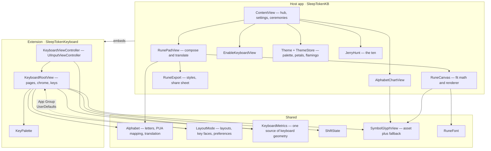

**Design rules the code holds to:**

- `KeyboardMetrics` is the only place keyboard geometry lives. The SwiftUI content lays itself out from it *and* the view controller reserves height from it, so the container can never promise less space than the rows occupy.
- `CanvasMetrics` plays the same role for Rune Pad, and both the fit math and the renderer consume the same derived constants.
- The extension never links `RuneFont` — it renders asset art only, and a keyboard extension has a tight memory budget.

---

## How state flows

Host-app settings reach the extension through an App Group, with a local fallback for the case where the extension's sandbox denies the shared container.

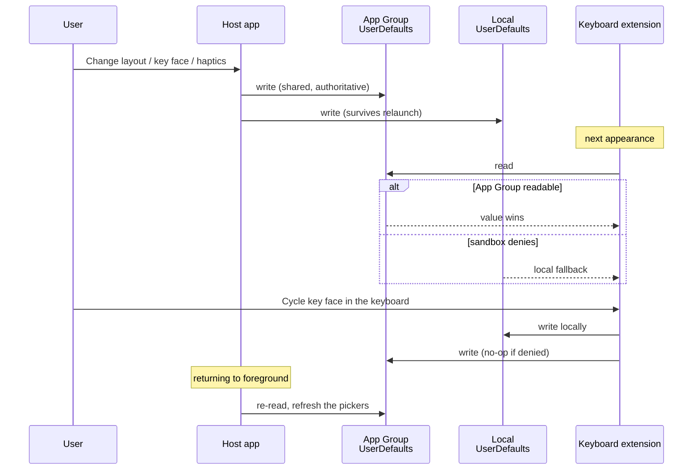

---

## Getting started

### Requirements

- macOS with **Xcode 15+**
- **iOS 26.5+** deployment target
- An Apple Developer team (free is fine) for device installs
- Optional: [`xcodegen`](https://github.com/yonaskolb/XcodeGen) if you edit `project.yml`

### Build and run

```bash
git clone https://github.com/thechrisgrey/sleep-token-kb.git
cd sleep-token-kb
open SleepTokenKB.xcodeproj
```

1. Select the **SleepTokenKB** scheme (not the extension alone).
2. Set your **Team** on all three targets. `project.yml` hardcodes one — change it *there*, not in Xcode, then re-run `xcodegen generate`.
3. Build and run. A physical iPhone is recommended; the Simulator supports keyboard extensions but you may need <kbd>⌘</kbd><kbd>K</kbd> to reveal the software keyboard.

> Both `Info.plist` files and both `.entitlements` files are **generated** from `project.yml`. Edit the YAML, not the XML — `xcodegen generate` overwrites them.

```bash
xcodegen generate   # after any project.yml change
```

### Identifiers

| Thing | Value |
|---|---|
| App bundle ID | `ai.altivum.SleepTokenFanKB` |
| Keyboard bundle ID | `ai.altivum.SleepTokenFanKB.SleepTokenKeyboard` |
| App Group | `group.ai.altivum.SleepTokenFanKB` |

The keyboard's ID must stay a suffix of the app's, and both targets need the App Group or host settings will never reach the keyboard.

### Enable the keyboard

iOS never auto-enables a third-party keyboard. Once, after installing:

1. Open **Settings** (the app has a button that deep-links straight there)
2. Tap **Keyboards** on the Sleep Token KB page — or go the long way: **General → Keyboard → Keyboards**
3. Turn on **Sleep Token KB**
4. In any text field, long-press the **globe** key and pick it

Missing from the list? Force-quit Settings, reinstall the app, try again. Extensions only appear after the host app has been installed at least once.

---

## Testing

```bash
./scripts/test.sh          # builds both targets and runs the suite
DEVICE="iPhone 16" ./scripts/test.sh
```

Sixty-three tests cover the pure-logic layer — the parts where a silent regression would be invisible in the UI until a user hit it.

| Suite | Tests | What it pins |
|---|:---:|---|
| `KeyboardMetricsTests` | 10 | Reserved height always covers content, for every page × layout × face × size class |
| `AlphabetTests` | 9 | PUA round-tripping, Latin translation, pass-through of non-rune characters |
| `KeyboardPreferencesTests` | 8 | Defaults, round-trips, and migration of the legacy Latin-hints flag |
| `ShiftStateTests` | 7 | The three-state machine and one-shot consumption |
| `CanvasMetricsTests` | 6 | Rune Pad fit math stays inside the plaque — including the trailing caret |
| `JerryHuntTests` | 6 | Ten spots, stable persistence format, exactly-once celebration |
| `LayoutModeTests` | 6 | The key-face cycle visits every case; short titles stay distinct |
| `ThemeTests` | 6 | Theme persistence, unknown-value fallback, palette actually changes |
| `KeyboardLayoutTests` | 5 | Both layouts contain all 26 letters exactly once |

> Tests passing is not the same as shipped-and-working. Every feature here was also exercised by hand in the Simulator — the keyboard typing into Safari, the pasteboard inspected after each export, the ceremonies watched frame by frame.

---

## Project structure

```
sleep-token-kb/
├── SleepTokenKB/              # Host app
│   ├── ContentView.swift          # Hub, settings, ceremony hosting
│   ├── RunePadView.swift          # Composer + live translation
│   ├── RuneCanvas.swift           # Fit math + shared renderer
│   ├── RuneExport.swift           # Export styles, share sheet
│   ├── AlphabetChartView.swift    # 26-glyph reference
│   ├── EnableKeyboardView.swift   # Setup walkthrough
│   ├── Theme.swift                # Palette, petals, Jerry, cards
│   ├── ArcadiaRevealView.swift    # Theme-switch ceremony
│   ├── JerryHunt.swift            # The hunt + Damocles reward
│   └── SleepTokenRunes.ttf        # PUA-mapped rune font
├── SleepTokenKeyboard/        # Keyboard extension
│   ├── KeyboardViewController.swift
│   ├── KeyboardRootView.swift
│   └── KeyPalette.swift
├── Shared/                    # Linked into both targets
│   ├── Alphabet.swift
│   ├── LayoutMode.swift
│   ├── KeyboardMetrics.swift
│   ├── ShiftState.swift
│   ├── SymbolGlyphView.swift
│   └── RuneFont.swift
├── SleepTokenKBTests/         # 63 tests, 9 suites
├── scripts/
│   ├── test.sh                    # Build + test
│   └── build_rune_font.py         # SVG → TTF pipeline
├── docs/
│   └── feature-optimization.md    # Living refinement record
└── project.yml                # Source of truth (xcodegen)
```

---

## Accessibility

Not an afterthought — the hunt included.

- **Keyboard keys** carry `.isKeyboardKey`, so VoiceOver users can touch-type. Chrome keys deliberately don't, keeping confirm-before-acting.
- **Shift** announces its three states distinctly (`off`, `on for one letter`, `caps lock on`).
- **The rune canvas** is one element that speaks the words you composed, not a stream of letters and shape hints.
- **Flagged words** are announced, not just underlined — the spell-check signal reaches non-sighted users.
- **Both ceremonies** hide the covered UI from the accessibility tree while the curtain is up, and announce themselves.
- **Every Jerry** is a labeled element, so the hunt is fully playable with VoiceOver.
- **Reduce Motion** is honoured everywhere: petals freeze, key presses stop scaling, ceremonies become crossfades.
- **Dynamic Type** scales the alphabet chart, which drops to two columns at accessibility sizes rather than truncating.

---

## Privacy & Full Access

**The keyboard requests no Full Access** (`RequestsOpenAccess = false`), which means it has no network capability whatsoever.

- Nothing you type is stored, logged, or transmitted. There is no analytics SDK, no crash reporter, no network code.
- Preferences are shared between the app and the keyboard through a local App Group container.
- Rune Pad's exports go to the system pasteboard or the share sheet — both user-initiated, both local.

---

## Regenerating the glyph assets

Real traced art ships for all 26 letters. To change it:

1. Edit the source SVGs in `stkb-runes-svg/`.
2. Re-run the PDF import loop and the font build — both commands are in `Assets/Symbols/README.md`.

```bash
pip install -r requirements.txt
python3 scripts/build_rune_font.py
```

The script expands every stroked centerline into a filled outline (TrueType has no strokes), centers each glyph like a keycap icon, and maps it into the PUA block.

---

## Social preview

Three 1280×640 social cards ship with the repo, each generated from source by a script in
`scripts/og/` — no design tool, no external assets. They composite real app captures, real
rune glyphs set from `SleepTokenRunes.ttf`, and Jerry drawn from the same geometry the app
uses, over the Even in Arcadia palette.

| Card | File | Direction |
|---|---|---|
| **Editorial hero** (in use) | [`docs/og-image.png`](docs/og-image.png) | Serif wordmark and rune row over two tilted devices; Jerry in the lower gap |
| Device showcase | [`docs/og-devices.png`](docs/og-devices.png) | Three fanned screens showing the gold/pink theme duality |
| Glyph-forward | [`docs/og-glyph.png`](docs/og-glyph.png) | One enormous inscription band of runes; maximum restraint |

```bash
python3 scripts/og/editorial.py   # or devices.py / glyph.py
```

To change which one GitHub serves in link unfurls: **Settings → General → Social preview →
Upload an image**. GitHub exposes no API for this, so it is the one step that must be done
in the web UI.

---

## Legal

**Unofficial fan project. Not affiliated with, endorsed by, or connected to Sleep Token or their rights holders.**

Sleep Token's names, iconography, and the ritual alphabet are almost certainly protected. This is fine for personal and TestFlight use; public App Store distribution would need rights clearance and clear "not affiliated" labeling.

No album artwork, photography, or audio is included in this repository. The Damocles reward opens the official Apple Music listing — it does not bundle, stream, or reproduce the recording.

The code is [MIT licensed](LICENSE).

---

<div align="center">

<br>

### Dedicated to the beautiful Erikka Rose - the ultimate Sleep Token fan.

<br>

<sub>Worship.</sub>

</div>
